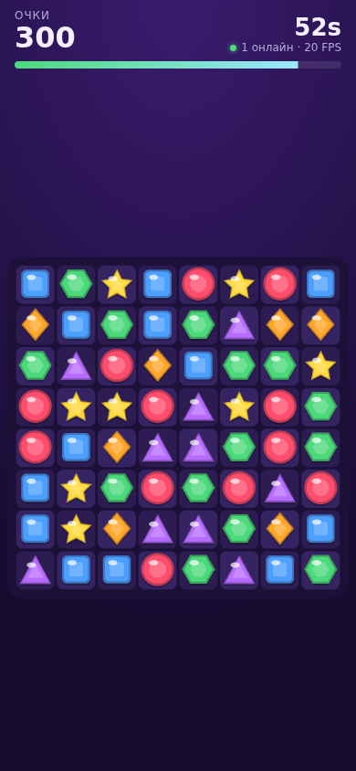
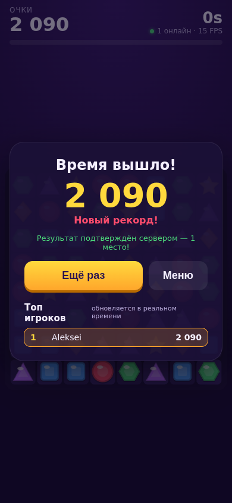

# Gem Rush — Match-3 на React + TypeScript + PixiJS

Браузерная игра «три в ряд» на 60 секунд с онлайн-лидербордом через WebSocket.
Сервер **проверяет каждый результат**: он проигрывает партию заново по seed и списку ходов.

<p>
  
  
</p>

## Стек

| Слой | Технологии |
|---|---|
| Рендер игры | **PixiJS v8** (WebGL), свой tween-движок, пул частиц |
| UI поверх игры | **React 19** + **TypeScript**, `useSyncExternalStore` |
| Сеть | **WebSocket** (браузерный API на клиенте, `ws` на сервере) |
| Сервер | **Node.js**, TypeScript, без фреймворков |
| Общий код | Логика доски и протокол в пакете `@match3/shared` (monorepo, npm workspaces) |
| Тесты | Vitest |
| Сборка | Vite, esbuild |

## Запуск

```bash
npm install
npm run dev          # сервер :8787 + Vite :5173 → http://localhost:5173
```

Продакшен (клиент и WebSocket на одном порту):

```bash
npm run build
npm start            # http://localhost:8787
```

Проверки: `npm test` и `npm run typecheck`.

> Чтобы проверить игру на телефоне: `npm run dev` и откройте `http://<IP-компьютера>:5173` в той же Wi-Fi сети.

## Структура

```
packages/
  shared/            # общий код клиента и сервера
    board.ts         # чистая логика match-3: генерация, свап, каскады, гравитация, перемешивание
    rng.ts           # детерминированный ГПСЧ (mulberry32)
    replay.ts        # повтор партии по seed + ходам (серверная валидация)
    protocol.ts      # типы сообщений WS (discriminated unions) и валидация входных данных
    board.test.ts
  server/
    index.ts         # WS-сервер: сессии, лидерборд, онлайн, heartbeat, rate limit
    leaderboard.ts   # топ-10 с сохранением в JSON
    static.ts        # раздача собранного клиента
  client/src/
    game/
      GameView.ts    # всё про PixiJS: сцена, анимации, ввод (свайп и тап)
      Game.ts        # контроллер: таймер, запись ходов, подсказки
      tween.ts       # анимации на промисах поверх Ticker
      particles.ts   # частицы с пулом объектов
      textures.ts    # текстуры камней генерируются один раз из Graphics
    net/SocketClient.ts  # реконнект с backoff, request/response поверх WS, heartbeat
    app/controller.ts    # связка UI, сети и игры
    app/store.ts         # внешний стор + useSyncExternalStore
    ui/                  # React-компоненты: HUD, меню, Game Over, лидерборд
```

## Как это работает

### Разделение логики и рендера
`Board` — чистый TypeScript без зависимостей от браузера. Ход возвращает описание
всего, что произошло: какие камни исчезли, какие упали и откуда, какие появились.
`GameView` просто анимирует эти шаги. Благодаря этому:
- логику можно покрыть unit-тестами;
- тот же код работает на сервере;
- отображение можно заменить (например, на Spine-анимации), не трогая правила.

### React ↔ PixiJS
- Canvas создаётся один раз в `PixiStage` и не пересоздаётся при смене экранов.
  Асинхронный `app.init()` корректно отменяется при размонтировании, в том числе при двойном монтировании в StrictMode.
- Игра пишет состояние во внешний `Store`, компоненты подписываются через `useSyncExternalStore` с селекторами.
- Таймер обновляет React **раз в секунду**, а не каждый кадр, поэтому React не перерисовывается 60 раз в секунду.

### WebSocket и anti-cheat
1. Клиент отправляет `startGame`, сервер выдаёт `gameId` и **seed**. Клиент не может сам выбрать удачную доску.
2. Клиент играет и записывает ходы `{r1,c1,r2,c2,t}`.
3. После игры клиент отправляет ходы (не счёт!). Сервер проигрывает партию через тот же `Board`
   и сам считает очки. Отклоняются невалидный ход, ход после 60 секунд, нарушенный порядок ходов,
   ходы «быстрее реального времени» и повторная отправка результата.
4. Новый рекорд рассылается всем подключённым клиентам.

Клиент: реконнект с экспоненциальным backoff и jitter, мгновенный реконнект по событию `online`,
app-level ping для обнаружения «полуоткрытых» соединений, корреляция запросов по `reqId` с таймаутами.
Если сервер недоступен, игра работает офлайн.
Сервер: heartbeat через ping/pong для отключения мёртвых клиентов, `maxPayload`, валидация всех
входящих сообщений, санитизация ников, rate limit, graceful shutdown.

### Производительность и мобильные устройства
- Текстуры камней генерируются один раз (`generateTexture`) и переиспользуются, поэтому спрайты рисуются батчами.
- Один обработчик ввода на всю доску вместо 64 отдельных.
- Пул объектов для частиц, чтобы не нагружать GC на слабых телефонах.
- `resolution` ограничен 2: DPR 3 на телефоне означает в 2,25 раза больше пикселей без заметной разницы в картинке.
- Рендер ставится на паузу, когда вкладка или WebView уходит в фон (`visibilitychange`), чтобы экономить батарею.
- Адаптивная раскладка под любой экран, `touch-action: none`, safe-area для iOS, `prefers-reduced-motion`.
- В HUD выводится FPS.

## Что можно добавить (roadmap)
- [ ] Спецкамни (линия за 4 в ряд, бомба за 5) и их комбинации
- [ ] **Spine**-анимации камней и персонажа (`@esotericsoftware/spine-pixi-v8`)
- [ ] Звуки (`@pixi/sound`), вибрация на мобильных
- [ ] Атлас текстур (spritesheet) вместо генерации из Graphics
- [ ] Режим «дуэль» 1-на-1 в реальном времени через WebSocket
- [ ] Dockerfile + деплой, CI с тестами
- [ ] Хранение в PostgreSQL/Redis вместо JSON-файла

## e2e-хук
Если открыть страницу с `?debug`, появится `window.__match3.findMove()`.
Через него бот (Playwright) находит валидные ходы при автотестах.
